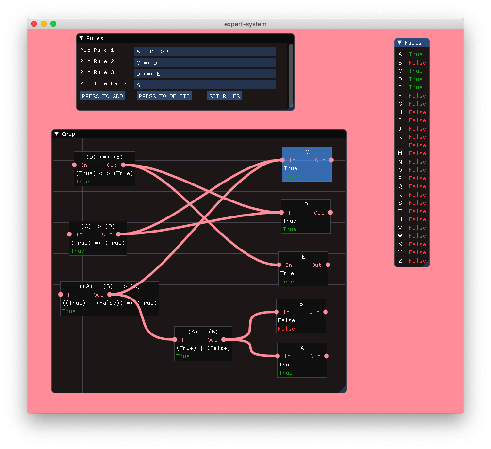

# expert-system

## Build

```bash
# Build was tested only on MacOS, clang-1100.0.33.17
bash install_dependencies.sh
mkdir build_dir
cd build_dir
cmake -DCMAKE_BUILD_TYPE="Release" .. && make -j 4
```

## Usage

```bash
./expert-system -g
```

## Screenshots



## License
[MIT](https://choosealicense.com/licenses/mit/)
